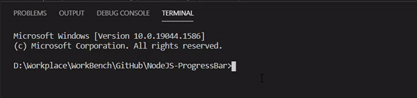
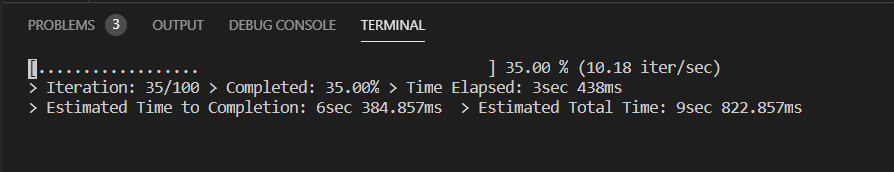
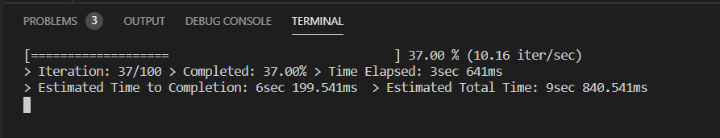
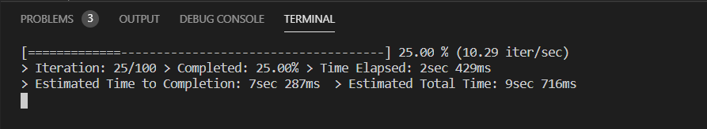
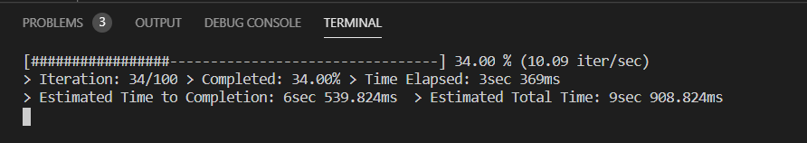
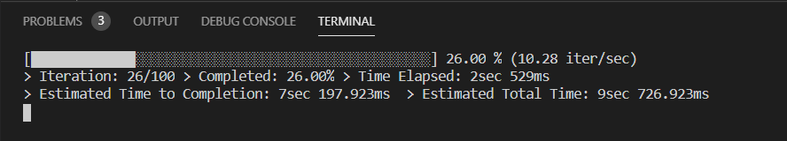

# NodeJS-ProgressBar
[](https://www.npmjs.com/package/progress-bar-cli)
[](http://hits.dwyl.com/mratanusarkar/NodeJS-ProgressBar)
[](https://npmcharts.com/compare/progress-bar-cli?minimal=true)
[](LICENSE)

CLI Progress Bar for NodeJS and JavaScript to track Time, ETA and Steps for any long running jobs in any loops in JS, NodeJS code

Did you ever encounter long running processes or jobs running inside loops in javascript or nodejs? Did you ever encounter tasks where nodejs scripts are running in a server, making multiple api calls in long running loops?

If you are tired of sitting and waiting for these processes and not knowing when this kind of job/loop will end. If you want to have a metrics that will show you the current iteration number of the loop, eta of the job, time elapsed, time to finish, estimated total time along with a cool cli progress bar, and even notify you with an alert sound when the job ends... then you are at the right place!

Here is a running demo of the cli progress bar below: <br>




# Features
The function progressBar() can be applied to any deterministic loop with finite and determined loop_len. <br>

It has the following features:
- you can change and modify the progress bar length
- you can choose from the list of available cli ascii styles for the progress bar
- you can resume the progress from the ith iteration (see examples)
- you can set notify for the progress bar to alert and notify you with sound when the task is complete
- you can choose to print out every iteration of the progress bar without clearing out the console screen
- all time information in the progress bar matrices are converted and printed in human readable time

Available matrices:
  - iteration (current-step / total-step)
  - number of iter / sec
  - percentage completion
  - time elapsed
  - estimated time to completion
  - estimated total time


Here are some of the ascii styles you can choose from:

1. style=0<br>


2. style=1<br>


3. style=2<br>


4. style=3<br>


5. style=4<br>



# Installation
```cmd
npm i progress-bar-cli
```


# Usage
```node
const progressBar = require("progress-bar-cli");

let loop_len = 1000;
let startTime = new Date();
for (i = 0; i < loop_len; ++i) {
    // call progressBar at the start of the loop block
    progressBar.progressBar(i, loop_len, startTime);
    
    /** START OF LONG RUNNING JOB/PROCESS IN LOOP*/
    //
    // Insert your CODE Here!!
    //
    /** END OF LONG RUNNING JOB/PROCESS IN LOOP*/
}
```


If the job get's haulted in the middle or if the Job was multiple API calls in a loop, and maybe due to network issues the process got haulted, <br>
you can trace the last iteration of the running job from log files (if you are maintaining any), and resume the job from that ith iteration using the following code:

```node
const progressBar = require("progress-bar-cli");

let resumeFrom = 50;
let loop_len = 1000;
let startTime = new Date();
for (i = 0; i < loop_len; ++i) {
    // call progressBar at the start of the loop block
    progressBar.progressBar(i, loop_len, startTime);
    
    // code to skip to the ith iteration and continue from there
    if (i < resumeFrom) {
        console.log("> skipping", i);
        continue;
    }
    
    /** START OF LONG RUNNING JOB/PROCESS IN LOOP*/
    //
    // Insert your CODE Here!!
    //
    /** END OF LONG RUNNING JOB/PROCESS IN LOOP*/
}
```


# Function Parameters
Parameter Name | Data Type | default value | description
---------------|-----------|---------------|-------------
currentStep | {Number} | *required | the current iteration number in the loop. eg: i, index or count
totalSteps | {Number} | *required | total number of steps that the loop will run for.
startTime | {Date} | *required | pass the start time of the loop. It should be a Date object. eg: 'new Date()'
clearScreenEvery | {Number} | 1 | console to be cleared off every ith iteration of this value.
barLength | {Number} | 50 | the length of the progress bar.
style | {Number} | 4 | choose styles from 0 - 4.
notify | {Boolean} | true | set true for sound alert notification when complete. false to turn it off
**function return** | {Number} | NA | currentStep++

**Please Note**: * are the three required parameters for the function


# Example
Below are some of the example codes where progressBar is used.

1. using for loop:
```node
const progressBar = require("progress-bar-cli");

// Main for testing the Progress Bar!
let loop_len = 100;
let counter = 0;
let resumeFrom = 0;
let startTime = new Date();

console.time("total system time");
for (i = 0; i < loop_len; ++i) {
    counter = progressBar.progressBar(counter, loop_len, startTime);

    if (counter < resumeFrom) {
        console.log("> skipping", counter);
        continue;
    }

    // do some time consuming task in loop
    var waitTill = new Date(new Date().getTime() + 100);
    while(waitTill > new Date()){}
}
console.timeEnd("total system time");

```

2. using while loop
```node
const progressBar = require("progress-bar-cli");

// Main for testing the Progress Bar!
let loop_len = 100;
let counter = 0;
let startTime = new Date();

console.time("total system time");
while (counter < loop_len) {
    counter = progressBar.progressBar(counter, loop_len, startTime);

    // do some time consuming task in loop
    var waitTill = new Date(new Date().getTime() + 100);
    while(waitTill > new Date()){}
}
console.timeEnd("total system time");

```


# Planned features for upcoming version
TODO: add examples in readme for forEach, for/in, for/of, do/while and other types of loops in js and node <br>
TODO: add support for async loops in js and node <br>
TODO: add support for macOS <br>
TODO: make the cli ui even better <br>

